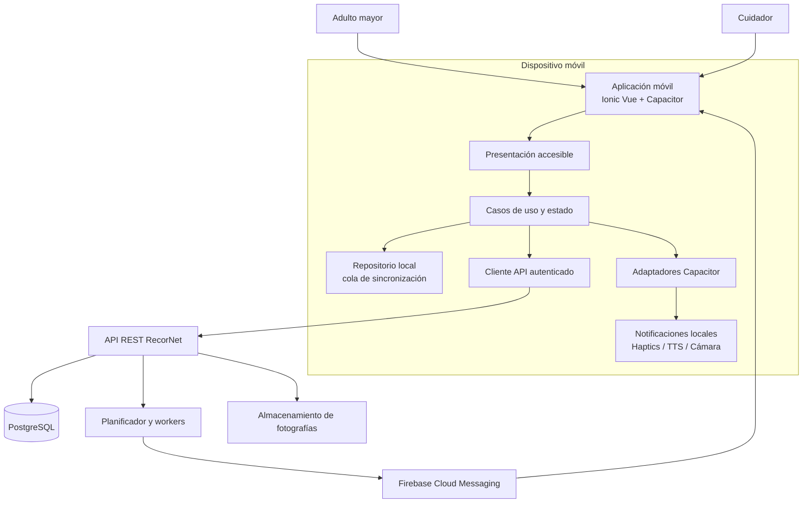
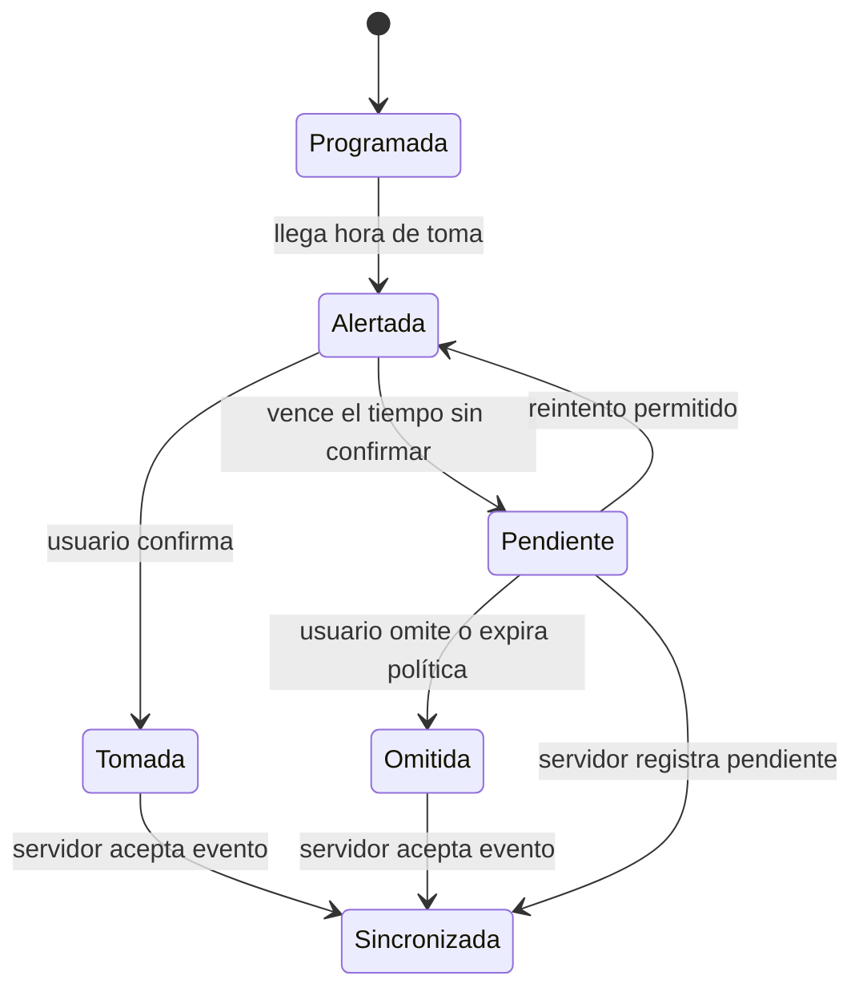

# Arquitectura móvil de RecorNet

**Estado:** Propuesta técnica base  
**Plataformas objetivo:** Android e iOS  
**Cliente recomendado:** Ionic Vue + Capacitor + TypeScript  
**Autor:** Manus AI  
**Última actualización:** 11 de agosto de 2026

---

## 1. Propósito y alcance

Este documento define la arquitectura objetivo de la aplicación móvil de **RecorNet**. La aplicación debe ayudar a adultos mayores a cumplir tratamientos farmacológicos mediante recordatorios claros, accesibles y redundantes, al tiempo que permite a cuidadores gestionar tratamientos y consultar alertas de dosis pendientes. Estas responsabilidades se derivan del contexto funcional, los roles y las reglas de negocio del proyecto.[1] [2]

La arquitectura propuesta prioriza cuatro propiedades: **confiabilidad de los recordatorios**, **accesibilidad verificable**, **seguridad de los datos de salud** y **operación tolerante a conectividad intermitente**. La versión móvil no reemplaza al backend: conserva al servidor como fuente de verdad para usuarios, tratamientos, historial y estadísticas, y mantiene en el dispositivo un estado local mínimo que permite entregar recordatorios y registrar acciones de forma segura cuando la red no está disponible.[1] [3]

> **Decisión arquitectónica:** para mantener coherencia con la arquitectura web documentada —Vue 3, TypeScript, Router, Pinia y Axios— la opción móvil de referencia es **Ionic Vue sobre Capacitor**. La demostración Expo/React Native existente es útil como prototipo de comportamiento nativo, pero no constituye por sí misma la arquitectura de producción hasta que el equipo apruebe formalmente una estrategia multicliente.[4] [5]

| Atributo de calidad | Objetivo de arquitectura |
| --- | --- |
| Confiabilidad | El recordatorio programado debe poder activarse localmente, incluso ante una conexión temporalmente inestable. |
| Accesibilidad | Los flujos críticos deben poder completarse con controles grandes, texto adaptable, contraste suficiente y lectura asistida. |
| Seguridad | Las autorizaciones se validan en el backend; el cliente solo conserva el mínimo de datos y tokens necesarios. |
| Mantenibilidad | La lógica de dominio y de sincronización se separa de vistas, plugins nativos y transporte HTTP. |
| Trazabilidad | Las confirmaciones, omisiones, reintentos y errores de sincronización generan eventos observables. |

---

## 2. Contexto, usuarios y límites del sistema

RecorNet contempla dos roles operativos. El **adulto mayor** consulta sus medicamentos, recibe alertas y confirma tomas; el **cuidador** administra medicamentos, horarios y tratamientos de los adultos mayores que tiene vinculados. El historial y las estadísticas son visibles para ambos dentro de los límites definidos por sus permisos.[1] [2]

| Actor | Capacidades móviles principales | Restricciones relevantes |
| --- | --- | --- |
| Adulto mayor | Ver próxima toma, recibir alerta multisensorial, confirmar o posponer/omitir una toma, consultar historial y estadísticas simplificadas. | No modifica medicamentos ni horarios de forma directa. |
| Cuidador | Crear, editar y eliminar medicamentos; programar horarios; recibir avisos por dosis pendientes; consultar seguimiento. | Solo actúa sobre adultos mayores vinculados y autorizados. |
| Backend | Autenticación, autorización, persistencia, cálculo de métricas, coordinación de tratamientos y notificaciones remotas. | Es la fuente de verdad y aplica controles de acceso por rol. |
| Servicios externos | Firebase Cloud Messaging y Cloudinary, encapsulados por el backend. | El cliente móvil no debe exponer credenciales de estos servicios. |

La aplicación móvil se comunica exclusivamente con la API REST documentada por el backend. Las fotografías de medicamentos se capturan localmente, se preparan como `multipart/form-data` y se envían al endpoint autenticado; el backend decide la persistencia y la integración con el almacenamiento externo.[4] [5]

---

## 3. Vista de contenedores

La aplicación recibe **dos tipos de señales**. Las notificaciones locales se programan desde el dispositivo para los horarios de medicación disponibles y reducen la dependencia de la red en el momento de la toma. Las notificaciones push son emitidas por el backend para eventos remotos, cambios de tratamiento o escalamiento hacia el cuidador. Ambas vías deben llevar un identificador de tratamiento, medicamento y dosis para impedir duplicaciones y facilitar la conciliación.[1] [3] [5]

---

## 4. Capas internas de la aplicación

La solución móvil usa una separación pragmática por responsabilidades. Ninguna vista debe invocar directamente un plugin de Capacitor o realizar solicitudes HTTP; esos detalles se encapsulan en adaptadores y servicios para que los flujos críticos sean comprobables mediante pruebas automatizadas.

| Capa | Responsabilidad | Ejemplos de módulos |
| --- | --- | --- |
| Presentación | Vistas, componentes, navegación, estados de carga/error y semántica accesible. | `MedicationCard`, `DoseConfirmationSheet`, `LargeActionButton`, `ReminderAlertView`. |
| Aplicación | Casos de uso y coordinación entre estado, API, almacenamiento y notificaciones. | `ScheduleMedicationReminders`, `ConfirmDose`, `SyncPendingActions`, `UpdateTreatment`. |
| Dominio cliente | Tipos, validadores y reglas deterministas que pueden ejecutarse sin red. | `Medication`, `Treatment`, `DoseEvent`, `Reminder`, `CareRelation`. |
| Datos | Repositorios, persistencia local, cola de operaciones y cliente REST. | `TreatmentRepository`, `DoseEventQueue`, `ApiClient`, `AuthSessionStore`. |
| Infraestructura | Adaptadores a capacidades del dispositivo y a integraciones. | `LocalNotificationsAdapter`, `HapticsAdapter`, `SpeechAdapter`, `CameraAdapter`, `NetworkAdapter`. |

### 4.1 Estado de interfaz y estado remoto

Pinia administra el estado global de sesión, usuario, preferencias de accesibilidad y elementos necesarios para la navegación. TanStack Query administra datos remotos con caché, invalidación y reintentos controlados. La cola offline no debe vivir únicamente en memoria: necesita persistencia local para resistir el cierre de la aplicación o el reinicio del dispositivo.[5]

| Tipo de información | Ubicación principal | Estrategia de actualización |
| --- | --- | --- |
| Sesión y token | Almacenamiento seguro de Capacitor. | Renovar o cerrar sesión ante expiración; nunca registrar el token en logs. |
| Preferencias de accesibilidad | Persistencia local y, si se define, perfil remoto. | Aplicar al inicio de la app antes de renderizar contenido sensible. |
| Tratamientos activos | Caché local sincronizada con API. | Revalidar tras iniciar sesión, volver a primer plano y modificar un tratamiento. |
| Eventos de toma | Cola local con identificadores idempotentes. | Enviar al recuperar conectividad; conservar hasta recibir confirmación del servidor. |
| Programación local | Plugin de notificaciones y registro local de programación. | Reconciliar después de cada sincronización de tratamientos. |

---

## 5. Modelo de dominio móvil

El modelo móvil debe usar identificadores estables del servidor y distinguir la definición del tratamiento de los eventos que ocurren durante su ejecución. Esta separación evita que editar un horario destruya el historial de dosis ya confirmadas.

| Entidad o valor | Campos mínimos | Regla clave |
| --- | --- | --- |
| `Medication` | `id`, `name`, `description`, `photoUrl`, `dose`, `frequency`. | Nombre, dosis, frecuencia, horarios, fechas, descripción y fotografía se validan como obligatorios según las reglas de negocio.[2] |
| `Treatment` | `id`, `medicationId`, `patientId`, `startDate`, `endDate`, `schedules`, `status`, `version`. | Al cambiar su versión u horarios se cancelan y recrean los recordatorios locales asociados. |
| `DoseEvent` | `idempotencyKey`, `treatmentId`, `scheduledAt`, `status`, `confirmedAt`, `source`. | El estado refleja `scheduled`, `taken`, `pending`, `skipped` o `failed`; nunca se duplica una confirmación. |
| `Reminder` | `notificationId`, `doseEventKey`, `scheduledAt`, `channel`, `status`. | Relaciona una alarma local con una dosis y permite cancelarla o actualizarla. |
| `CareRelation` | `caregiverId`, `elderlyId`, `permissions`, `status`. | El cliente muestra acciones solo si la relación existe; el backend vuelve a validarla. |

### 5.1 Máquina de estados de una dosis

La política de reintento y escalamiento se configura por tratamiento o por perfil, pero siempre debe registrar la transición del estado. Si un adulto mayor no confirma dentro del límite acordado, la aplicación repite el recordatorio o marca la dosis como pendiente; el backend puede notificar al cuidador cuando esa opción esté habilitada.[1] [2]

---

## 6. Recordatorios y capacidades nativas

El mecanismo de recordatorio es el núcleo de la arquitectura móvil. Debe diseñarse como una experiencia multisensorial y no como un único mensaje de texto. La alerta presenta el nombre, foto, dosis, descripción y hora del medicamento, y combina elementos visuales, sonido, voz y vibración cuando la configuración y el sistema operativo lo permiten.[1] [2]

| Necesidad | Adaptador sugerido | Uso arquitectónico |
| --- | --- | --- |
| Alarmas en horario | `@capacitor/local-notifications` | Programa, actualiza y cancela alertas locales; cada alerta referencia un `DoseEvent`. |
| Avisos remotos | `@capacitor/push-notifications` | Registra el dispositivo para FCM y procesa cambios, alertas de cuidador o invalidaciones. |
| Vibración | `@capacitor/haptics` | Proporciona confirmación suave al tocar y patrón destacado en recordatorios. |
| Lectura por voz | Adaptador TTS compatible con Capacitor | Lee nombre y dosis cuando el usuario habilita la función o la alerta lo requiere. |
| Fotografía | `@capacitor/camera` | Captura una imagen, aplica límites de tamaño y la entrega al cliente de carga. |
| Conectividad | Adaptador de red | Detecta recuperación de red para disparar la sincronización de cola. |

### 6.1 Algoritmo de reconciliación de recordatorios

Después de una autenticación inicial, una sincronización exitosa o una modificación de tratamiento, el caso de uso `ReconcileLocalReminders` debe seguir esta secuencia:

1. Obtiene los tratamientos activos y sus versiones desde la API o caché validada.
2. Genera las dosis futuras dentro de una ventana configurable, por ejemplo los próximos 30 días.
3. Compara esas dosis con los identificadores locales programados.
4. Cancela únicamente las alarmas que ya no correspondan a una dosis activa.
5. Programa las nuevas alarmas con identificadores deterministas y datos mínimos de presentación.
6. Registra el resultado de la operación y alerta de forma visible si el sistema deniega permisos de notificación.

> **Invariante:** una edición de tratamiento no puede dejar activas alarmas correspondientes a horarios eliminados. La actualización de datos y la reconciliación local deben considerarse una sola operación de negocio con reintentos seguros.[2] [3]

---

## 7. Sincronización y funcionamiento sin conexión

La aplicación debe funcionar con un enfoque **local-first acotado**. Esto no significa que el móvil sea fuente de verdad, sino que puede mantener el contexto necesario para alertar y capturar una acción del usuario mientras no hay red. Las mutaciones de alto riesgo —como editar un tratamiento— se deben bloquear o informar claramente si no es posible resolver conflictos de forma segura.

| Operación | Permitir sin conexión | Estrategia |
| --- | --- | --- |
| Recibir alarma local | Sí | Se basa en programación existente del dispositivo. |
| Confirmar toma | Sí | Crear `DoseEvent` con clave de idempotencia y encolarlo. |
| Consultar tratamientos ya sincronizados | Sí | Mostrar marca de última actualización para evitar falsa certeza. |
| Crear/editar/eliminar tratamiento | Preferentemente no | Requiere autorización y reconciliación de horarios; permitir solo si se implementa resolución de conflictos explícita. |
| Cargar fotografía | No | Conservar borrador local y reintentar bajo aprobación del usuario. |
| Ver estadísticas actuales | Parcial | Mostrar último cálculo disponible e indicar fecha de actualización. |

La cola se procesa al recuperar conectividad, volver al primer plano y antes de una actualización de tratamientos. Cada solicitud mutante incluye `idempotencyKey`, marca temporal local, versión del tratamiento y origen del evento. Ante un conflicto de versión, el cliente conserva el evento, obtiene la versión vigente y presenta una decisión comprensible en lugar de sobrescribir silenciosamente información clínica.

---

## 8. API, autenticación y autorización

El cliente usa un único `ApiClient` configurado con la URL por entorno. El interceptor añade el JWT desde el almacenamiento seguro y procesa estados 401/403 con una ruta controlada: limpiar sesión si corresponde, preservar acciones offline que puedan ser reconciliadas y mostrar un mensaje sencillo, sin detalles técnicos.[4] [5]

| Recurso de API | Operaciones móviles | Validaciones obligatorias |
| --- | --- | --- |
| `/auth` | Inicio de sesión, renovación/cierre de sesión, recuperación de contraseña. | Nunca almacenar contraseñas; manejar token expirado de forma amigable. |
| `/medications` y `/treatments` | Consultar, crear, actualizar, eliminar y cargar fotografía. | Permiso de cuidador, relación con adulto mayor, campos requeridos y prevención de duplicados. |
| `/dose-events` | Confirmar, marcar pendiente u omitir una dosis. | Idempotencia, pertenencia al tratamiento y transición de estado válida. |
| `/history` y `/statistics` | Consultar seguimiento y métricas. | Visibilidad por rol y relación de cuidado. |
| `/devices` o equivalente | Registrar token push, sistema operativo y preferencias. | Consentimiento de notificaciones y revocación segura. |

La autorización real se aplica siempre en el backend. Ocultar una pantalla en el cliente mejora la experiencia, pero no constituye una medida de seguridad. El mismo principio aplica a la relación cuidador–adulto mayor y a la modificación de tratamientos.[2] [3]

---

## 9. Accesibilidad y experiencia de usuario

La arquitectura traduce las exigencias de accesibilidad en componentes, tokens y pruebas reproducibles. No se trata de una capa final de diseño: la accesibilidad es un criterio de aceptación de cada flujo, especialmente para la confirmación de toma y la gestión de medicamentos.[1] [4] [5]

| Requisito | Decisión de implementación | Prueba de aceptación |
| --- | --- | --- |
| Tipografía adaptable | Tokens en `rem`/`em` y respeto de escalado del sistema. | Aumento de fuente al 200 % sin recorte de acciones críticas. |
| Contraste | Tema normal y de alto contraste con tokens semánticos. | Relación 4.5:1 en texto normal y 3:1 en texto grande. |
| Objetivos táctiles | Botones y controles principales de 44 × 44 puntos o más. | Medición en pantallas de medicamento y confirmación. |
| Lectores de pantalla | Etiquetas accesibles, orden de foco y texto alternativo dinámico para fotos. | Recorrido por teclado/lector sin controles ambiguos. |
| Alertas redundantes | Información visual junto a sonido, voz y vibración. | La alerta se comprende aun con audio desactivado. |
| Carga cognitiva | Pocas acciones visibles, copy simple, confirmaciones antes de omitir o eliminar. | Confirmación de toma en tres pasos o menos. |

Los componentes de accesibilidad se centralizan para evitar divergencias entre pantallas: `AccessibleButton`, `MedicationImage`, `ContrastToggle`, `FontScaleControl`, `VoiceReader` y `ReminderFeedback`. Cada componente expone semántica y comportamiento consistentes.

---

## 10. Seguridad, privacidad y tratamiento de datos

Los datos de medicación y adherencia son sensibles. El móvil almacena solamente lo indispensable, cifra o delega el secreto al almacén seguro del sistema y evita registrar información clínica completa en analítica o archivos de log. Las contraseñas nunca se guardan en el cliente; el backend almacena hashes y controla permisos por rol.[2] [3]

| Riesgo | Mitigación móvil |
| --- | --- |
| Pérdida del dispositivo | JWT y secretos en almacenamiento seguro; cierre de sesión remoto si el backend lo soporta. |
| Exposición en notificación bloqueada | Configuración de contenido discreto y preferencia del usuario para ocultar detalles sensibles. |
| Manipulación de acciones locales | Validación de transición e idempotencia en el servidor; no confiar en el reloj del cliente para autorización. |
| Fotos demasiado grandes o privadas | Compresión previa, validación de tipo/tamaño y transmisión TLS al endpoint autenticado. |
| Acceso entre roles | Guardias de navegación como ayuda de UX y autorización obligatoria de API como control efectivo. |

Las políticas de retención, anonimización, eliminación de cuenta, exportación de datos y auditoría deben definirse por el responsable del producto antes de una publicación. El documento de reglas solicita auditorías periódicas de datos, seguridad, integridad, disponibilidad y notificaciones; la implementación deberá convertir esa solicitud en responsables, frecuencia y evidencias concretas.[2]

---

## 11. Observabilidad, pruebas y calidad de entrega

La aplicación genera eventos técnicos sin incluir datos personales innecesarios: estado de permiso de notificaciones, resultado de programación local, tamaño de cola offline, reintentos, errores de API clasificados y versión de tratamiento reconciliada. La telemetría se relaciona con identificadores pseudonimizados y respeta la política de privacidad.

| Nivel de prueba | Alcance mínimo |
| --- | --- |
| Unitarias | Validación de tratamientos, generación de dosis, transiciones de `DoseEvent`, deduplicación e idempotencia. |
| Integración | Adaptadores de API, almacenamiento seguro simulado, reconciliación de recordatorios y cola offline. |
| Dispositivo | Permisos, notificaciones locales, haptics, TTS, cámara y comportamiento al volver de segundo plano. |
| E2E | Inicio por rol, CRUD de cuidador, recepción/confirmación de recordatorio, dosis pendiente, historial y estadísticas. |
| Accesibilidad | Contraste, escalado tipográfico, foco, lector de pantalla, objetivos táctiles y redundancia de alertas. |

Los escenarios de calidad ya identificados en la habilidad de pruebas son una base de trazabilidad. En particular, los casos TOMA-01 a TOMA-04, REM-03, MED-01 a MED-07 y los controles de roles deben convertirse en pruebas automatizadas antes de aprobar una versión móvil.[5]

---

## 12. Ruta de implementación recomendada

| Fase | Resultado verificable |
| --- | --- |
| 1. Fundaciones | Proyecto Ionic Vue/Capacitor, configuración de entornos, sesión segura, navegación por rol y tema accesible. |
| 2. Tratamientos | Consulta y CRUD de medicamentos para cuidador, validaciones, carga de fotografía y sincronización de tratamientos. |
| 3. Recordatorios | Programación local, vista de alarma, haptics, voz y confirmación de toma con registro de historial. |
| 4. Resiliencia | Cola offline, idempotencia, reconciliación de alarmas y recuperación al reconectar. |
| 5. Acompañamiento | Push para cuidador, historial, estadísticas y preferencias de accesibilidad persistentes. |
| 6. Calidad | Pruebas por dispositivo, E2E, auditoría WCAG y observabilidad de producción. |

No se debe publicar un flujo de medicación mientras los requisitos de permisos, programación local, cancelación al modificar tratamientos y registro de confirmación no estén comprobados en dispositivos físicos Android e iOS.

---

## 13. Decisiones abiertas

| Decisión | Alternativas | Responsable sugerido |
| --- | --- | --- |
| Cliente móvil de producción | Ionic Vue + Capacitor; Expo/React Native; coexistencia de clientes. | Liderazgo técnico y producto. |
| Ventana de programación local | 7, 30 o 60 días; replanificación en background. | Producto y equipo móvil. |
| Política de dosis sin confirmar | Número de reintentos, tiempo límite y criterio de escalamiento. | Producto con asesoría clínica. |
| Privacidad en pantalla bloqueada | Mostrar detalle completo, resumen discreto o preferencia por usuario. | Producto, seguridad y usuarios piloto. |
| Conflictos offline de tratamientos | Bloquear mutaciones, borradores o resolución guiada. | Arquitectura y backend. |

Estas decisiones deben registrarse como ADR (Architecture Decision Records) antes de que afecten contratos de API, diseño de datos o experiencia de un adulto mayor.

---

## Referencias

[1]: ../contexto/CONTEXTO%20GENRAL.md "Contexto general de RecorNet"
[2]: ../reglas/reglas_del_negocio.md "Reglas del negocio de RecorNet"
[3]: backend.md "Arquitectura backend de RecorNet"
[4]: frontend.md "Arquitectura frontend de RecorNet"
[5]: ../../.agents/skills/mobile-skill/recornet-capacitor-dev.skill "Habilidad de desarrollo móvil con Capacitor"
[6]: ../../.agents/skills/frontend-skill/recornet-frontend-testing.skill "Habilidad de pruebas frontend de RecorNet"
