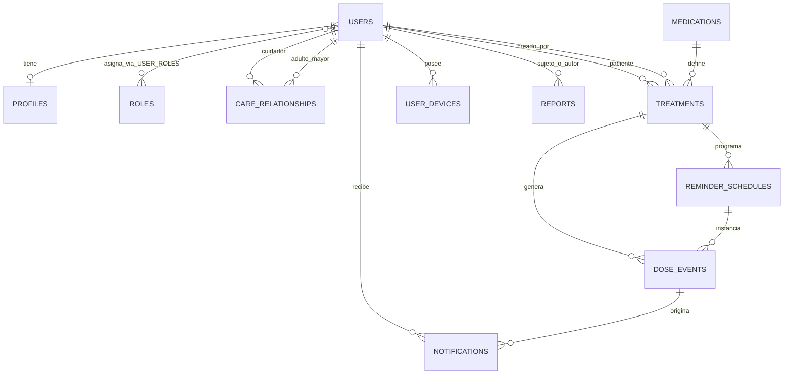

# 🧠  Recornet - Arquitectura y Stack Tecnológico backend

## 📌 Descripción General
**RecorNet** es un software multiplataforma (Android y Web) diseñado para ayudar a los adultos mayores a cumplir correctamente con el tratamiento de sus medicamentos mediante recordatorios inteligentes, accesibles y fáciles de utilizar.

## 🏗️ Arquitectura General
El backend de **RecorNet** se compone de una API RESTful y un sistema de base de datos relacional (PostgreSQL) siguiendo la arquitectura de  clean architecture + hexagonal architecture.


## Componentes principales

1. 🟢 API / Gateway (Backend principal)

Tecnología: Python + Flask + Swagger + Gunicorn 

**Funciones:**

- API REST

- Punto de entrada (API Gateway ligero)

- Autenticación

- Gestión de usuarios (adultos mayores y cuidadores)

- Gestión de familias

- Gestión de medicamentos y tratamientos

- Gestión de recordatorios inteligentes

- Gestión de notificaciones push

- Gestión de estadísticas

- Gestión de reportes

2. 🟢 Workers (Backend secundario)

Tecnología: Python + Celery

**Funciones:**

- Planificador

- Notificaciones Push

- Almacenamiento de imágenes

- Estadísticas

- Reportes

3. 🔔 Sistema de Notificaciones (Backend secundario)
Tecnología: Python + Firebase Cloud Messaging
**Funciones:**

- Notificaciones Push   

4. 💽 Sistema de Almacenamiento de Imágenes (Backend secundario)
Tecnología: Python + Cloudinary
**Funciones:**

- Almacenamiento de imágenes

5. 📈📊 Sistema de Estadísticas (Backend secundario)
Tecnología: Python + Redis
**Funciones:**

- Estadísticas

6. 🗒️ Sistema de Reportes (Backend secundario)
Tecnología: Python + PostgreSQL
**Funciones:**

- Reportes

7.🐳 Contenerización (Backend secundario)
Tecnología: Docker

**Funciones:**

- Contenerización de servicios (PostgreSQL, Redis, Celery Worker y Celery Beat)


Arquitectura: Clean Architecture + Hexagonal

## 📁 Estructura del proyecto arquitectura backend: Clean Architecture + Hexagonal:

```text
backend/
├── api/                # Flask API REST (Clean Architecture + Hexagonal)      
├── shared/             # (Opcional) utilidades compartidas
├── docker/             # Docker files
├── docker-compose.yml      # Orquestación de servicios
│
├── requirements.txt     # Dependencias de la aplicación
│
├── .env.example         # Ejemplo de archivo de variables de entorno
│
├── .gitignore           # Archivo de ignorados
│
└── README.md            # Descripción del proyecto
```

## 📁 Estructura interna:

```text
backend/ (python + flask + swagger + uvicorn)       
│
├── src/
│
│   ├── domain/                              # Núcleo del dominio
│   │
│   │   ├── entities/
│   │   │   ├── user.py
│   │   │   ├── caregiver.py
│   │   │   ├── elderly.py
│   │   │   ├── medication.py
│   │   │   ├── treatment.py
│   │   │   ├── reminder.py
│   │   │   ├── medication_history.py
│   │   │   ├── notification.py
│   │   │   └── statistics.py
│   │   │
│   │   ├── value_objects/
│   │   │   ├── dosage.py
│   │   │   ├── schedule.py
│   │   │   ├── medication_image.py
│   │   │   └── reminder_time.py
│   │   │
│   │   ├── services/
│   │   │   ├── adherence_service.py
│   │   │   ├── reminder_service.py
│   │   │   ├── statistics_service.py
│   │   │   └── notification_service.py
│   │   │
│   │   ├── repositories/
│   │   │   ├── user_repository.py
│   │   │   ├── medication_repository.py
│   │   │   ├── treatment_repository.py
│   │   │   ├── reminder_repository.py
│   │   │   ├── history_repository.py
│   │   │   └── statistics_repository.py
│   │   │
│   │   ├── ports/
│   │   │   ├── cloudinary_port.py
│   │   │   ├── firebase_port.py
│   │   │   ├── redis_port.py
│   │   │   ├── jwt_port.py
│   │   │   └── email_port.py
│   │   │
│   │   └── exceptions/
│   │
│   ├── application/
│   │
│   │   ├── use_cases/
│   │   │
│   │   ├── auth/
│   │   ├── users/
│   │   ├── caregivers/
│   │   ├── elderly/
│   │   ├── medications/
│   │   ├── treatments/
│   │   ├── reminders/
│   │   ├── notifications/
│   │   ├── statistics/
│   │   ├── dashboard/
│   │   └── reports/
│   │
│   │   ├── dto/
│   │   │
│   │   ├── commands/
│   │   │
│   │   ├── queries/
│   │   │
│   │   └── mappers/
│   │
│   ├── infrastructure/
│   │
│   │   ├── api/
│   │   │
│   │   ├── controllers/
│   │   ├── routes/
│   │   ├── middlewares/
│   │   ├── validators/
│   │   ├── serializers/
│   │   └── schemas/
│   │
│   │   ├── persistence/
│   │   │
│   │   ├── models/
│   │   ├── repositories/
│   │   ├── migrations/
│   │   ├── database.py
│   │   └── seed.py
│   │
│   │   ├── cache/
│   │   │
│   │   └── redis.py
│   │
│   │   ├── cloud/
│   │   │
│   │   ├── firebase/
│   │   │   └── firebase_service.py
│   │   │
│   │   ├── cloudinary/
│   │   │   └── cloudinary_service.py
│   │   │
│   │   └── jwt/
│   │       └── jwt_service.py
│   │
│   │   ├── workers/
│   │   │
│   │   ├── celery.py
│   │   ├── reminder_worker.py
│   │   ├── notification_worker.py
│   │   ├── report_worker.py
│   │   └── statistics_worker.py
│   │
│   │   ├── scheduler/
│   │   │
│   │   └── celery_beat.py
│   │
│   │   └── logging/
│   │
│   ├── config/
│   │
│   │   ├── settings.py
│   │   ├── dependencies.py
│   │   ├── swagger.py
│   │   ├── celery_config.py
│   │   └── security.py
│   │
│   ├── docs/
│   │
│   │   └── openapi/
│   │
│   ├── shared/
│   │
│   │   ├── constants/
│   │   ├── enums/
│   │   ├── helpers/
│   │   ├── utils/
│   │   ├── decorators/
│   │   ├── exceptions/
│   │   └── responses/
│   │
│   └── main.py
│
├── tests/
│   ├── unit/
│   ├── integration/
│   ├── e2e/
│   └── fixtures/
│
├── .env
├── .env.example
├── requirements.txt
├── Docker/
│   ├── postgres/
│   ├── redis/
│   ├── celery-worker/
│   └── celery-beat/
│
├── docker-compose.yml
├── README.md
└── .gitignore
```

## Tecnologías asociadas:

| Componente                 | Tecnología                                              |
| -------------------------- | ------------------------------------------------------- |
| Framework Backend          | Flask                                                   |
| Servidor WSGI              | Gunicorn                                                |
| Base de datos              | PostgreSQL                                              |
| ORM                        | SQLAlchemy                                              |
| Migraciones                | Flask-Migrate                                           |
| Arquitectura               | Clean Architecture + Hexagonal                          |
| Autenticación              | JWT                                                     |
| Caché / Broker             | Redis                                                   |
| Procesamiento asíncrono    | Celery                                                  |
| Planificador               | Celery Beat                                             |
| Notificaciones Push        | Firebase Cloud Messaging                                |
| Almacenamiento de imágenes | Cloudinary                                              |
| Documentación API          | Swagger                                                 |
| Validación                 | Pydantic                                                |
| Pruebas                    | Pytest                                                  |
| Contenedores               | Docker (PostgreSQL, Redis, Celery Worker y Celery Beat) |


## Funciones:

- Gestión de usuarios (adultos mayores y cuidadores).
- Gestión de medicamentos y tratamientos.
- Gestión de recordatorios inteligentes.
- Gestión de notificaciones push.
- Gestión de estadísticas.
- Gestión de reportes.

 ## Base de Datos:

Motor: PostgreSQL
Contenerización: Docker
ORM: SQLAlchemy
Migraciones: Flask-Migrate
Funciones:
- Gestión de usuarios (adultos mayores y cuidadores).
- Gestión de medicamentos y tratamientos.
- Gestión de recordatorios inteligentes.
- Gestión de notificaciones push.
- Gestión de estadísticas.
- Gestión de reportes.
- diagrama entidad relacion:



| Relación               | Cardinalidad | Evaluación                                         | Recomendación                                                                                                            |
| ---------------------- | ------------ | -------------------------------------------------- | ------------------------------------------------------------------------------------------------------------------------ |
| User → Profile         | 1:1          | Correcta                                           | Usa `profiles.user_id` como PK/FK. Perfil es extensión opcional del usuario.                                             |
| User → Role            | N:M          | Válida solo si un usuario puede tener varios roles | Implementa tabla puente `user_roles`. Si un usuario solo puede tener un rol activo, usa `roles 1:N users`.               |
| Profile → Role         | 1:1          | Incorrecta                                         | El rol pertenece a `User`, no a `Profile`.                                                                               |
| User → Medication      | 1:N          | Incompleta                                         | Mejor: `User (paciente) 1:N Treatment` y `Medication 1:N Treatment`. La dosis/horario pertenecen al tratamiento.         |
| User → Treatment       | 1:N          | Correcta para el paciente                          | Añade también `created_by_user_id` para el cuidador que lo crea/modifica.                                                |
| User → Reminder        | 1:N          | Correcta, pero indirecta                           | Modela `Treatment 1:N ReminderSchedule`; los recordatorios se derivan del tratamiento.                                   |
| User → Notification    | 1:N          | Correcta                                           | Añade `DoseEvent 1:N Notification` para conservar el origen de cada aviso.                                               |
| User → Statistics      | 1:N          | Generalmente innecesaria                           | Calcula estadísticas desde `dose_events`; persiste `statistics_snapshots` solo si necesitas caché por período.           |
| User → Report          | 1:N          | Posible                                            | El reporte debe tener `subject_user_id` y `created_by_user_id`; también puede generarse bajo demanda.                    |
| Relaciones con Service | —            | Incorrectas o prematuras                           | `Service` no parece una entidad de negocio; FCM, Cloudinary, Celery y Redis son infraestructura, no tablas relacionales. |


## Caché / Broker:

Motor: Redis, Celery Beat y Celery Worker 
Funciones:
- Planificador
- Estadísticas
- Reportes      
 

## Notificaciones Push:

Motor: Firebase Cloud Messaging
Funciones:
- Notificaciones Push   
 
## Almacenamiento de imágenes:

Motor: Cloudinary
Funciones:
- Almacenamiento de imágenes
 
## Estadísticas:

Motor: Redis
Funciones:
- Estadísticas
 
## Reportes:

Motor: PostgreSQL
Funciones:
- Reportes

## Docker:

Motor: Docker
Se utiliza Docker para facilitar despliegue y desarrollo:
Funciones:
- Contenerización de servicios (PostgreSQL, Redis, Celery Worker y Celery Beat)

## Comunicación entre servicios:


## Comunicación entre componentes:


✅ Conclusión

La arquitectura de  RecorNet se basa en la arquitectura de Clean Architecture + Hexagonal, que es una arquitectura que se enfoca en separar el código de negocio del código de infraestructura, lo que permite una mejor organización y mantenimiento del código.

Ser escalable
Mantener separación clara de responsabilidades
Permitir evolución hacia sistemas más complejos
Facilitar la comunicación entre componentes
Facilitar la comunicación entre servicios
Mantenimiento de la arquitectura
Mejora continua
Migración de la base de datos
Gestión de la caché
Gestión de la planificación
Gestión de las notificaciones push
Gestión de las estadísticas
Gestión de los reportes
Mejora de la seguridad y rendimiento
Seguridad de la aplicación y usuarios


