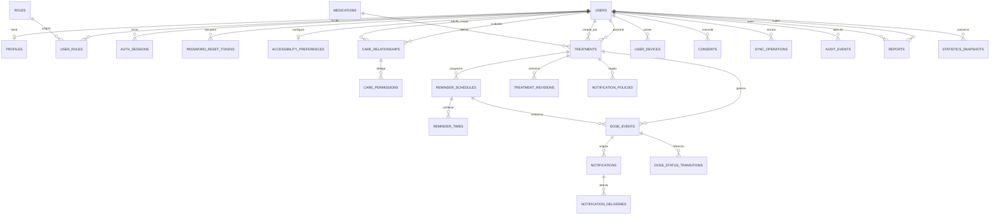
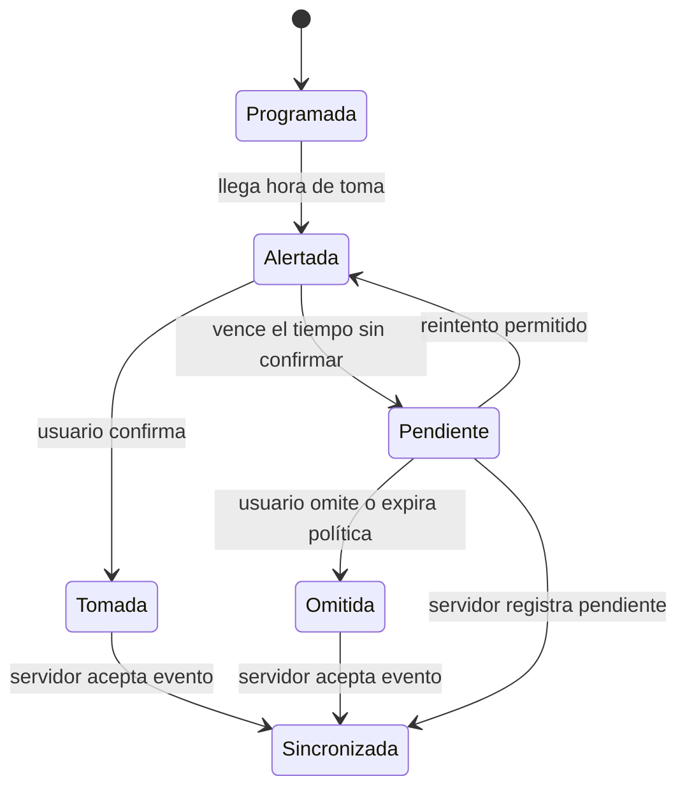

# Base de Datos de RecorNet

## Descripción general

Este documento detalla la arquitectura de la base de datos que se utilizará en el proyecto **RecorNet**. El modelo persiste cuatro dominios complementarios: **identidad y cuidado**, **ciclo de medicación**, **notificación accesible** y **gobierno operativo**. El último concentra consentimiento, sesiones, auditoría, revisiones y operaciones offline, de modo que la aplicación no pierda trazabilidad cuando el dispositivo carece temporalmente de conexión. La separación entre la definición de un tratamiento y las instancias de dosis generadas por ese tratamiento permite modificar horarios sin destruir el historial de dosis ya confirmadas, y garantiza que una confirmación de toma nunca se duplique gracias a la clave de idempotencia.



## Diagrama de la máquina de estados de una dosis

El estado de cada evento de dosis sigue la máquina documentada en `arquitectura_movil.md` y se registra en la columna `status`:



## Tablas, relaciones y descripción

| Tabla | Clave | Descripción |
|-------|-------|-------------|
| `users` | `id` (PK) | Usuario principal: adulto mayor o cuidador. Datos de identidad y credenciales (contraseña como hash). Eliminado con soft delete. No contiene una columna `role`: la asignación se centraliza en `user_roles`. |
| `profiles` | `user_id` (PK/FK) | Extensión opcional del usuario con datos adicionales (preferencias, foto, ubicación). |
| `accessibility_preferences` | `user_id` (PK/FK) | Preferencias accesibles explícitas: escala tipográfica, alto contraste, voz, hápticos y reducción de movimiento. |
| `roles` | `id` (PK) | Catálogo de roles: `patient` (adulto mayor), `caregiver` (cuidador). Un eventual rol `admin` interno debe aprobarse explícitamente por producto antes de habilitarse. |
| `user_roles` | `(user_id, role_id)` (PK compuesta) | Tabla puente N:M entre usuarios y roles; permite evolución futura sin cambiar el modelo. |
| `auth_sessions` | `id` (PK) | Sesiones renovables y revocables; conserva hash del token de renovación, dispositivo y vencimiento. |
| `password_reset_tokens` | `id` (PK) | Token de recuperación de acceso almacenado como hash, con vencimiento y consumo único. |
| `medications` | `id` (PK) | Catálogo del medicamento: nombre, descripción, forma, fabricante, estado y fotografía. No contiene dosis ni frecuencia porque dependen de la prescripción del paciente. |
| `treatments` | `id` (PK) | Prescripción que une un paciente, un cuidador autor y un medicamento con fechas de inicio/fin, dosis e instrucciones. Cada modificación incrementa `version`. |
| `treatment_revisions` | `id` (PK) | Historial de versiones de tratamiento, con autor y cambios; apoya la resolución explícita de conflictos. |
| `reminder_schedules` | `id` (PK) | Regla de recurrencia asociada a un tratamiento. FK `treatment_id`; conserva zona horaria y días de la semana. |
| `reminder_times` | `id` (PK) | Hora(s) del día para cada programación; evita almacenar horarios en JSON y permite validarlos e indexarlos. |
| `notification_policies` | `id` (PK) | Política de reintentos y escalamiento de un tratamiento o usuario: intervalo, máximo de intentos y umbral de pendiente. |
| `dose_events` | `id` (PK) | Instancias de dosis programadas. FK `schedule_id` y `treatment_id`; incluye `idempotency_key` única. El estado clínico de la toma y el estado de sincronización se conservan en columnas separadas. |
| `dose_status_transitions` | `id` (PK) | Transición inmutable entre estados de una dosis, con actor, motivo y marca temporal. |
| `notifications` | `id` (PK) | Registro de avisos locales o push. FK `dose_event_id` y `recipient_user_id`, con canal, estado de entrega y payload. |
| `notification_deliveries` | `id` (PK) | Intento individual de enviar una notificación a un dispositivo; registra reintentos, proveedor, entrega o fallo. |
| `user_devices` | `id` (PK) | Dispositivos registrados con tokens FCM, sistema operativo y preferencias de notificación. FK `user_id`. |
| `consents` | `id` (PK) | Evidencia temporal de consentimiento o revocación para tratamiento de datos, avisos y guía por voz. |
| `reports` | `id` (PK) | Reportes de seguimiento generados por el cuidador o por el sistema. FK explícitas `subject_user_id` y `created_by_user_id`. |
| `statistics_snapshots` | `id` (PK) | Snapshot histórico opcional de estadísticas (adherencia, rachas), complementario a la caché de Redis. |
| `sync_operations` | `id` (PK) | Cola durable de operaciones offline con idempotencia, reintentos y último error conocido. |
| `audit_events` | `id` (PK) | Registro inmutable de acciones relevantes de seguridad, cambios de estado, acceso y entregas. |
| `care_permissions` | `id` (PK) | Permiso individual, revocable y auditable dentro de una relación cuidador-adulto mayor. |

## Esquema DDL de referencia (PostgreSQL)

Las definiciones siguientes sirven como punto de partida para los modelos SQLAlchemy y las migraciones de Flask-Migrate. Los tipos, restricciones e índices reflejan las reglas de negocio: campos obligatorios validados, idempotencia en confirmaciones, soft delete y versionado de tratamientos.

```sql
CREATE TABLE roles (
    id   SERIAL PRIMARY KEY,
    name TEXT NOT NULL UNIQUE CHECK (name IN ('patient', 'caregiver','admin'))
);

CREATE TABLE users (
    id            SERIAL PRIMARY KEY,
    name          TEXT NOT NULL,
    email         TEXT NOT NULL UNIQUE,
    password_hash TEXT NOT NULL,               -- nunca texto plano
    phone         TEXT,
    status        TEXT NOT NULL DEFAULT 'active' CHECK (status IN ('active', 'inactive', 'deleted')),
    deleted_at    TIMESTAMPTZ,
    created_at    TIMESTAMPTZ NOT NULL DEFAULT now(),
    updated_at    TIMESTAMPTZ NOT NULL DEFAULT now()
);

CREATE TABLE profiles (
    user_id      INTEGER PRIMARY KEY REFERENCES users(id) ON DELETE CASCADE,
    avatar_url   TEXT,
    preferences  JSONB NOT NULL DEFAULT '{}'   -- fuente, contraste, voz, vibración
);

CREATE TABLE accessibility_preferences (
    user_id                INTEGER PRIMARY KEY REFERENCES users(id) ON DELETE CASCADE,
    text_scale             NUMERIC(3,2) NOT NULL DEFAULT 1.00 CHECK (text_scale BETWEEN 0.80 AND 2.00),
    high_contrast          BOOLEAN NOT NULL DEFAULT false,
    voice_guidance_enabled BOOLEAN NOT NULL DEFAULT false,
    haptics_enabled        BOOLEAN NOT NULL DEFAULT true,
    reduce_motion          BOOLEAN NOT NULL DEFAULT false
);

CREATE TABLE user_roles (
    user_id INTEGER NOT NULL REFERENCES users(id) ON DELETE CASCADE,
    role_id INTEGER NOT NULL REFERENCES roles(id) ON DELETE CASCADE,
    PRIMARY KEY (user_id, role_id)
);

CREATE TABLE auth_sessions (
    id                 UUID PRIMARY KEY,
    user_id            INTEGER NOT NULL REFERENCES users(id) ON DELETE CASCADE,
    device_id          TEXT,
    refresh_token_hash TEXT NOT NULL UNIQUE,
    status             TEXT NOT NULL DEFAULT 'active' CHECK (status IN ('active', 'revoked', 'expired')),
    expires_at         TIMESTAMPTZ NOT NULL,
    revoked_at         TIMESTAMPTZ,
    created_at         TIMESTAMPTZ NOT NULL DEFAULT now()
);

CREATE TABLE password_reset_tokens (
    id         UUID PRIMARY KEY,
    user_id    INTEGER NOT NULL REFERENCES users(id) ON DELETE CASCADE,
    token_hash TEXT NOT NULL UNIQUE,
    expires_at TIMESTAMPTZ NOT NULL,
    used_at    TIMESTAMPTZ,
    created_at TIMESTAMPTZ NOT NULL DEFAULT now()
);

CREATE TABLE care_relationships (
    id         SERIAL PRIMARY KEY,
    caregiver_id INTEGER NOT NULL REFERENCES users(id) ON DELETE CASCADE,
    elderly_id   INTEGER NOT NULL REFERENCES users(id) ON DELETE CASCADE,
    permissions  JSONB NOT NULL DEFAULT '[]',
    status       TEXT NOT NULL DEFAULT 'active' CHECK (status IN ('active', 'revoked')),
    created_at   TIMESTAMPTZ NOT NULL DEFAULT now(),
    revoked_at   TIMESTAMPTZ,
    CONSTRAINT caregiver_differs_from_elderly CHECK (caregiver_id <> elderly_id),
    UNIQUE (caregiver_id, elderly_id)
);

CREATE TABLE care_permissions (
    id                   UUID PRIMARY KEY,
    care_relationship_id INTEGER NOT NULL REFERENCES care_relationships(id) ON DELETE CASCADE,
    code                 TEXT NOT NULL CHECK (code IN ('view_treatments', 'manage_treatments', 'view_history', 'view_statistics', 'receive_escalations')),
    granted_by_user_id   INTEGER REFERENCES users(id),
    granted_at           TIMESTAMPTZ NOT NULL DEFAULT now(),
    revoked_at           TIMESTAMPTZ,
    UNIQUE (care_relationship_id, code)
);

CREATE TABLE medications (
    id            SERIAL PRIMARY KEY,
    name          TEXT NOT NULL,
    description   TEXT,
    form          TEXT,                   -- tableta, jarabe, inyección...
    manufacturer  TEXT,
    photo_url     TEXT,                   -- servida desde Cloudinary
    status        TEXT NOT NULL DEFAULT 'active'
);

CREATE TABLE treatments (
    id               SERIAL PRIMARY KEY,
    medication_id    INTEGER NOT NULL REFERENCES medications(id),
    patient_user_id  INTEGER NOT NULL REFERENCES users(id),
    creator_user_id  INTEGER NOT NULL REFERENCES users(id),
    start_date       DATE NOT NULL,
    end_date         DATE NOT NULL,
    dose             TEXT NOT NULL,
    instructions     TEXT,
    version          INTEGER NOT NULL DEFAULT 1,
    status           TEXT NOT NULL DEFAULT 'active' CHECK (status IN ('active', 'paused', 'completed', 'cancelled')),
    CONSTRAINT end_after_start CHECK (end_date >= start_date),
    CONSTRAINT treatment_version_positive CHECK (version > 0)
);

CREATE TABLE treatment_revisions (
    id                 UUID PRIMARY KEY,
    treatment_id       INTEGER NOT NULL REFERENCES treatments(id) ON DELETE CASCADE,
    version            INTEGER NOT NULL CHECK (version > 0),
    changed_by_user_id INTEGER NOT NULL REFERENCES users(id),
    changes            JSONB NOT NULL DEFAULT '{}',
    created_at         TIMESTAMPTZ NOT NULL DEFAULT now(),
    UNIQUE (treatment_id, version)
);

CREATE TABLE reminder_schedules (
    id           SERIAL PRIMARY KEY,
    treatment_id INTEGER NOT NULL REFERENCES treatments(id) ON DELETE CASCADE,
    frequency    TEXT NOT NULL CHECK (frequency IN ('daily', 'weekly', 'interval')),
    weekdays     SMALLINT[] NOT NULL DEFAULT '{}', -- 0=domingo ... 6=sábado; vacío para diaria
    timezone     TEXT NOT NULL,
    is_active    BOOLEAN NOT NULL DEFAULT true
);

CREATE TABLE reminder_times (
    id          SERIAL PRIMARY KEY,
    schedule_id INTEGER NOT NULL REFERENCES reminder_schedules(id) ON DELETE CASCADE,
    time_of_day TIME NOT NULL,
    UNIQUE (schedule_id, time_of_day)
);

CREATE TABLE notification_policies (
    id                      UUID PRIMARY KEY,
    owner_user_id           INTEGER NOT NULL REFERENCES users(id),
    treatment_id            INTEGER REFERENCES treatments(id) ON DELETE CASCADE,
    repeat_interval_minutes INTEGER NOT NULL DEFAULT 10 CHECK (repeat_interval_minutes > 0),
    max_retries             INTEGER NOT NULL DEFAULT 3 CHECK (max_retries >= 0),
    pending_after_minutes   INTEGER NOT NULL DEFAULT 30 CHECK (pending_after_minutes > 0),
    escalation_target       TEXT NOT NULL DEFAULT 'caregiver' CHECK (escalation_target IN ('patient', 'caregiver')),
    enabled                 BOOLEAN NOT NULL DEFAULT true,
    CONSTRAINT notification_policy_timing CHECK (pending_after_minutes >= repeat_interval_minutes)
);

CREATE TABLE dose_events (
    id                SERIAL PRIMARY KEY,
    treatment_id      INTEGER NOT NULL REFERENCES treatments(id),
    schedule_id       INTEGER REFERENCES reminder_schedules(id),
    idempotency_key   TEXT NOT NULL UNIQUE,      -- evita duplicar confirmaciones
    scheduled_at      TIMESTAMPTZ NOT NULL,
    status            TEXT NOT NULL DEFAULT 'scheduled'
                      CHECK (status IN ('scheduled', 'alerted', 'taken',
                                         'pending', 'skipped')),
    sync_status       TEXT NOT NULL DEFAULT 'pending'
                      CHECK (sync_status IN ('pending', 'synced', 'failed')),
    confirmed_at      TIMESTAMPTZ,
    source            TEXT NOT NULL DEFAULT 'client' CHECK (source IN ('client', 'backend'))
);

CREATE TABLE dose_status_transitions (
    id                 UUID PRIMARY KEY,
    dose_event_id      INTEGER NOT NULL REFERENCES dose_events(id) ON DELETE CASCADE,
    from_status        TEXT,
    to_status          TEXT NOT NULL CHECK (to_status IN ('scheduled', 'alerted', 'taken', 'pending', 'skipped')),
    changed_by_user_id INTEGER REFERENCES users(id),
    reason             TEXT,
    occurred_at        TIMESTAMPTZ NOT NULL DEFAULT now()
);

CREATE TABLE notifications (
    id                SERIAL PRIMARY KEY,
    dose_event_id     INTEGER REFERENCES dose_events(id),
    recipient_user_id INTEGER NOT NULL REFERENCES users(id),
    channel           TEXT NOT NULL CHECK (channel IN ('push', 'local')),
    payload           JSONB NOT NULL DEFAULT '{}',
    delivery_status   TEXT NOT NULL DEFAULT 'queued'
                      CHECK (delivery_status IN ('queued', 'sent', 'delivered', 'failed', 'cancelled')),
    sent_at           TIMESTAMPTZ,
    delivered_at      TIMESTAMPTZ,
    failure_reason    TEXT
);

CREATE TABLE user_devices (
    id           SERIAL PRIMARY KEY,
    user_id      INTEGER NOT NULL REFERENCES users(id) ON DELETE CASCADE,
    device_id    TEXT NOT NULL UNIQUE,
    os           TEXT NOT NULL,
    fcm_token    TEXT,
    notifications_consent BOOLEAN NOT NULL DEFAULT false,
    UNIQUE (user_id, device_id)
);

CREATE TABLE notification_deliveries (
    id                  UUID PRIMARY KEY,
    notification_id     INTEGER NOT NULL REFERENCES notifications(id) ON DELETE CASCADE,
    user_device_id      INTEGER REFERENCES user_devices(id) ON DELETE SET NULL,
    attempt_number      INTEGER NOT NULL DEFAULT 1 CHECK (attempt_number > 0),
    status              TEXT NOT NULL DEFAULT 'queued' CHECK (status IN ('queued', 'sent', 'delivered', 'failed', 'cancelled')),
    provider_message_id TEXT,
    attempted_at        TIMESTAMPTZ,
    delivered_at        TIMESTAMPTZ,
    failure_reason      TEXT,
    UNIQUE (notification_id, attempt_number, user_device_id)
);

CREATE TABLE consents (
    id             UUID PRIMARY KEY,
    user_id        INTEGER NOT NULL REFERENCES users(id) ON DELETE CASCADE,
    user_device_id INTEGER REFERENCES user_devices(id) ON DELETE SET NULL,
    type           TEXT NOT NULL CHECK (type IN ('data_processing', 'notifications', 'voice_guidance')),
    status         TEXT NOT NULL DEFAULT 'granted' CHECK (status IN ('granted', 'revoked')),
    policy_version TEXT,
    granted_at     TIMESTAMPTZ NOT NULL DEFAULT now(),
    revoked_at     TIMESTAMPTZ
);

CREATE TABLE reports (
    id                SERIAL PRIMARY KEY,
    subject_user_id   INTEGER NOT NULL REFERENCES users(id),
    created_by_user_id INTEGER NOT NULL REFERENCES users(id),
    period_from       DATE NOT NULL,
    period_to         DATE NOT NULL,
    content           JSONB NOT NULL DEFAULT '{}',
    created_at        TIMESTAMPTZ NOT NULL DEFAULT now()
);

CREATE TABLE statistics_snapshots (
    id          SERIAL PRIMARY KEY,
    user_id     INTEGER NOT NULL REFERENCES users(id) ON DELETE CASCADE,
    snapshot_at TIMESTAMPTZ NOT NULL DEFAULT now(),
    metrics     JSONB NOT NULL DEFAULT '{}'   -- adherencia %, racha, dosis por estado
);

CREATE TABLE sync_operations (
    id              UUID PRIMARY KEY,
    user_id         INTEGER NOT NULL REFERENCES users(id) ON DELETE CASCADE,
    aggregate_type  TEXT NOT NULL,
    aggregate_id    TEXT NOT NULL,
    operation_type  TEXT NOT NULL,
    idempotency_key TEXT NOT NULL UNIQUE,
    payload         JSONB NOT NULL DEFAULT '{}',
    status          TEXT NOT NULL DEFAULT 'pending' CHECK (status IN ('pending', 'processing', 'succeeded', 'failed')),
    attempt_count   INTEGER NOT NULL DEFAULT 0 CHECK (attempt_count >= 0),
    last_error      TEXT,
    next_attempt_at TIMESTAMPTZ,
    created_at      TIMESTAMPTZ NOT NULL DEFAULT now()
);

CREATE TABLE audit_events (
    id             UUID PRIMARY KEY,
    actor_user_id  INTEGER REFERENCES users(id) ON DELETE SET NULL,
    action         TEXT NOT NULL CHECK (action IN ('create', 'update', 'delete', 'status_transition', 'access', 'delivery')),
    aggregate_type TEXT NOT NULL,
    aggregate_id   TEXT NOT NULL,
    correlation_id TEXT,
    metadata       JSONB NOT NULL DEFAULT '{}',
    occurred_at    TIMESTAMPTZ NOT NULL DEFAULT now()
);
```

### Índices recomendados

```sql
CREATE INDEX idx_dose_events_treatment  ON dose_events(treatment_id, scheduled_at);
CREATE INDEX idx_dose_events_scheduled  ON dose_events(scheduled_at)      WHERE status = 'scheduled';
CREATE INDEX idx_dose_events_unsynced   ON dose_events(scheduled_at)      WHERE sync_status = 'pending';
CREATE INDEX idx_notifications_recipient ON notifications(recipient_user_id, sent_at);
CREATE INDEX idx_care_elderly           ON care_relationships(elderly_id, status);
CREATE INDEX idx_snapshots_user         ON statistics_snapshots(user_id, snapshot_at);
CREATE INDEX idx_reminder_times_schedule ON reminder_times(schedule_id, time_of_day);
CREATE INDEX idx_transitions_dose_event   ON dose_status_transitions(dose_event_id, occurred_at);
CREATE INDEX idx_deliveries_notification  ON notification_deliveries(notification_id, attempt_number);
CREATE INDEX idx_sync_operations_pending  ON sync_operations(next_attempt_at) WHERE status IN ('pending', 'failed');
CREATE INDEX idx_audit_aggregate           ON audit_events(aggregate_type, aggregate_id, occurred_at);
```

## Seguridad de la base de datos

1. **Encriptación de datos.** Conexiones TLS entre aplicación y PostgreSQL; encriptación en reposo del volumen de datos (`pgdata`) y en tránsito de todas las conexiones. Las contraseñas se almacenan exclusivamente como hash (bcrypt/argon2), nunca en texto plano.
2. **Control de acceso.** Roles y permisos a nivel de aplicación (JWT) y principio de mínimo privilegio a nivel de base de datos: la aplicación usa un usuario PostgreSQL dedicado con privilegios DML, no el superusuario. Cada acceso sensible queda registrado (audit trail) en logs con datos personales pseudonimizados.
3. **Backup y recuperación.** Backups regulares de la base de datos mediante `pg_dump` programado dentro de la orquestación Docker, con retención definida; pruebas periódicas de restauración para verificar que los backups son válidos; backup adicional antes de cada migración de esquema.
4. **Integridad.** Restricciones de integridad en el esquema (PK, FK, CHECK, UNIQUE), validación en la capa de aplicación (Pydantic) y verificación periódica de integridad y limpieza de datos obsoletos.

> **Nota Docker:** las credenciales de conexión nunca se escriben en imágenes ni en `docker-compose.yml`; se inyectan por variables de entorno, según lo establecido en `docker.md`.

## Tecnologías

| Componente | Tecnología | Rol |
|------------|-----------|-----|
| Motor | PostgreSQL 16 | Persistencia principal de usuarios, tratamientos, dosis y notificaciones |
| Contenerización | Docker + Docker Compose | Servicios `postgres` con volumen nombrado `pgdata`, red interna aislada |
| ORM | SQLAlchemy | Modelos de datos y consultas parametrizadas contra inyección SQL |
| Migraciones | Flask-Migrate (Alembic) | Evolución del esquema versionada junto al código |
| Caché complementaria | Redis | Estadísticas en caliente y broker de Celery (datos volátiles por diseño) |

Funciones que soporta el modelo: gestión de usuarios (adultos mayores y cuidadores), tratamientos, recordatorios con generación de dosis, políticas de reintento y escalamiento, notificaciones push y locales con trazabilidad de entregas, preferencias de accesibilidad, consentimiento, sesiones revocables, estadísticas, reportes, auditoría y sincronización offline idempotente.

## Consultas SQL de referencia (seguras y parametrizadas)

Todas las consultas de la aplicación se ejecutan a través de SQLAlchemy con **parámetros enlazados**; nunca se concatenan valores de entrada en la cadena SQL. Los ejemplos siguientes muestran el equivalente parametrizado de las operaciones básicas:

```sql
-- 1. Insertar un nuevo usuario (campos especificados, contraseña YA como hash)
INSERT INTO users (name, email, password_hash, phone, status)
VALUES (:name, :email, :password_hash, :phone, 'active');

-- 2. Actualizar datos del usuario (solo los campos modificados, con WHERE obligatorio)
UPDATE users
SET name = :name, phone = :phone, updated_at = now()
WHERE id = :id;

-- 3. Eliminar un usuario (soft delete: se preserva el historial clínico de dosis)
UPDATE users
SET status = 'deleted', deleted_at = now(), updated_at = now()
WHERE id = :id;

-- 4. Buscar los datos de un usuario
SELECT id, name, email, phone, status
FROM users
WHERE id = :id AND status = 'active';

-- 5. Insertar un nuevo medicamento (campos obligatorios de negocio)
INSERT INTO medications (name, description, form, photo_url, status)
VALUES (:name, :description, :form, :photo_url, 'active')
RETURNING id;

-- 6. Actualizar un medicamento (versión del tratamiento vinculada se invalida en la app)
UPDATE medications
SET name = :name, description = :description
WHERE id = :id;

-- 7. Consulta central del producto: historial de dosis de un adulto mayor por periodo
SELECT de.id, de.scheduled_at, de.confirmed_at, de.status,
       m.name AS medication, t.dose
FROM dose_events de
JOIN treatments t      ON t.id = de.treatment_id
JOIN medications m     ON m.id = t.medication_id
WHERE t.patient_user_id = :elderly_id
  AND de.scheduled_at BETWEEN :from AND :to
ORDER BY de.scheduled_at DESC;

-- 8. Dosis pendientes de hoy para notificar al cuidador
SELECT de.id, de.scheduled_at, m.name, u.name AS elderly_name,
       cr.caregiver_id
FROM dose_events de
JOIN treatments t   ON t.id = de.treatment_id
JOIN medications m  ON m.id = t.medication_id
JOIN care_relationships cr ON cr.elderly_id = t.patient_user_id
WHERE de.status = 'pending'
  AND cr.caregiver_id = :caregiver_id
  AND cr.status = 'active';
```

En la capa de aplicación, el patrón es siempre el mismo — `session.execute(text(sql), params)` con diccionario de parámetros — o bien el uso directo del ORM (`session.add()`, `query.update()`), que SQLAlchemy traduce automáticamente a SQL parametrizado.

## Relación con la arquitectura general

Este modelo es la materialización en PostgreSQL de las entidades de dominio documentadas en `backend.md` y `arquitectura_movil.md` (`Medication`, `Treatment`, `DoseEvent`, `Reminder`/`reminder_schedules`, `CareRelation`), y de las reglas del negocio de `reglas_del_negocio.md` (campos obligatorios, prevención de duplicados, idempotencia de confirmaciones, roles asimétricos). La separación entre el catálogo de medicamentos y la prescripción (`treatments`) evita atribuir al medicamento una dosis o frecuencia que en realidad pertenece al paciente. Asimismo, `user_roles` es la única fuente de asignación de roles; `dose_events` separa el estado clínico de una toma de la sincronización; y los agregados de sesión, consentimiento, auditoría y entrega mantienen un rastro verificable de las operaciones sensibles. Los servicios de contenedores que lo hostean están definidos en `docker.md`.

---
**Autor:** Manus AI
**Versión:** 1.2.0
**Referencias:** `backend.md`, `arquitectura_movil.md`, `docker.md`, `reglas_del_negocio.md` y `CONTEXTO GENRAL.md` de RecorNet.
