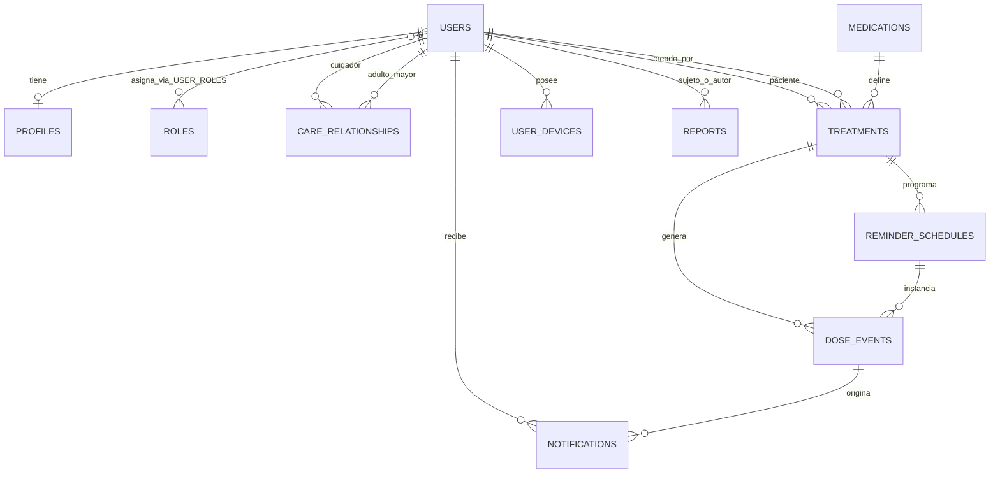

## base de datos  
En este apartado se detallara la  arquitetura de la base de datos que se utilizara en el proyecto.

## Modelo Entidad-Relación:


## Tablas y relaciones y  descripción

| Tabla             | Tipo         | Clave           | Comentarios                                                                  |
| ----------------- | ------------ | --------------- | ---------------------------------------------------------------------------- |
| `users`           | Tabla        | `id` (PK)       | Usuario principal (adulto mayor o cuidador).                                 |
| `profiles`        | Tabla        | `user_id` (PK/FK) | Extensión opcional del usuario con datos adicionales.                          |
| `user_roles`      | Tabla        | `(user_id, role_id)` | Tabla puente para N:M entre usuarios y roles.                                |
| `roles`           | Tabla        | `id` (PK)       | Roles: paciente, cuidador, admin, etc.                                       |
| `medications`     | Tabla        | `id` (PK)       |medicamentos.                                |
| `treatments`      | Tabla        | `id` (PK)       | Tratamientos, define dosis y horarios. FK `patient_user_id`, `creator_user_id`. |
| `reminder_schedules` | Tabla | `id` (PK) | Horarios/repetición de dosis. FK `treatment_id`.                           |
| `dose_events`     | Tabla        | `id` (PK)       | Instancias de dosis programadas. FK `schedule_id`, `medication_id`.        |
| `notifications`   | Tabla        | `id` (PK)       | Notificaciones enviadas. FK `dose_event_id`, `recipient_user_id`.           |
| `user_devices`    | Tabla        | `id` (PK)       | Dispositivos registrados (tokens FCM).                                       |
| `statistics_snapshots` | Tabla | `id` (PK) | Snapshot histórico de estadísticas (opcional).                                |
| `reports`         | Tabla        | `id` (PK)       | Reportes generados. FK `subject_user_id`, `created_by_user_id`.            |

## seguridad  de la base de datos :

1. Encriptacion de datos: 
  * Utilizar TLS para conexiones seguras
  * Utilizar encriptacion de datos sensibles en reposo 
  * Utilizar encriptacion de datos en transito

2. Control de acceso: 
  * Utilizar roles y permisos para controlar el acceso a los datos
  * Utilizar autenticacion multifactor para el acceso a los datos
  * Utilizar audit trail para el seguimiento de accesos a los datos

3. Backup y recuperacion: 
  * Realizar backups regulares de la base de datos
  * Realizar pruebas de recuperacion de la base de datos
  * Realizar pruebas de recuperacion de la base de datos

## Tecnologias :


Motor: PostgreSQL
Contenerización: Docker
ORM: SQLAlchemy
Migraciones: Flask-Migrate
Funciones:
- Gestión de usuarios (adultos mayores y cuidadores).
- Gestión de medicamentos y tratamientos.
- Gestión de recordatorios inteligentes.
- Gestión de notificaciones push.
- Gestión de estadísticas.
- Gestión de reportes.

## Consultas sql:

1.usar consultas sql seguras y optimizadas

2.usar consultas sql optimizadas para el rendimiento

3.usar consultas sql seguras para evitar inyecciones sql

4.  consultas basicas  seguras ejemplos:

1.insertarmos los datos del nuevo usuario, especificando cada campo.
```sql
INSERT INTO users (name, email, password, phone, address, city, state, zip_code, country, status) 
VALUES ('John Doe', [EMAIL_ADDRESS]', 'password', '123456789', '123 Main St', 'New York', 'NY', '10001', 'USA', 'active');
```

2.actualizamos los datos del usuario, especificando cada campo.
```sql
UPDATE users 
SET name = 'John Doe', email = 'john.doe@example.com', password = 'password', phone = '123456789', address = '123 Main St', city = 'New York', state = 'NY', zip_code = '10001', country = 'USA', status = 'active' 
WHERE id = 1;
```

3.eliminamos los datos del usuario, especificando cada campo.
```sql
DELETE FROM users 
WHERE id = 1;
```

4.buscamos los datos del usuario, especificando cada campo.
```sql
SELECT * FROM users 
WHERE id = 1;
``` 
5.insertarmos los datos del nuevo medicamento, especificando cada campo.
```sql
INSERT INTO medications (name, description, strength, form, manufacturer, status) 
VALUES ('Medication Name', 'Medication Description', 'Medication Strength', 'Medication Form', 'Medication Manufacturer', 'active');
```
6.actualizamos los datos del medicamento, especificando cada campo.
```sql
UPDATE medications 
SET name = 'Medication Name', description = 'Medication Description', strength = 'Medication Strength', form = 'Medication Form', manufacturer = 'Medication Manufacturer', status = 'active' 
WHERE id = 1;
```

