# 🧠  Recornet - Arquitectura y Stack Tecnológico frontend web

## 📝 Descripción general
**RecorNet** es un software multiplataforma (Android y Web) diseñado para ayudar a los adultos mayores a cumplir correctamente con el tratamiento de sus medicamentos mediante recordatorios inteligentes, accesibles y fáciles de utilizar.
El frontend es el componente que se encarga de mostrar la interfaz de usuario de la aplicación. El frontend se compone de una aplicación web que se ejecuta en el navegador del usuario, y se utiliza para mostrar la interfaz de usuario de la aplicación.

## 🏗️ Arquitectura General
El frontend de **RecorNet** se compone de una aplicación web que se ejecuta en el navegador del usuario, y se utiliza para mostrar la interfaz de usuario de la aplicación.

### 🏗️ Estructura del proyecto
 ````
 frontend/
│
├── public/
│
├── src/
│   │
│   ├── assets/                  # Imágenes, íconos, fuentes y estilos
│   │
│   ├── components/              # Componentes reutilizables
│   │   ├── common/
│   │   ├── forms/
│   │   ├── charts/
│   │   ├── notifications/
│   │   └── accessibility/
│   │
│   ├── views/                   # Páginas
│   │   ├── auth/
│   │   ├── dashboard/
│   │   ├── medications/
│   │   ├── reminders/
│   │   ├── statistics/
│   │   ├── caregivers/
│   │   ├── elderly/
│   │   └── profile/
│   │
│   ├── layouts/                 # Layouts generales
│   │   ├── AdminLayout.vue
│   │   ├── AuthLayout.vue
│   │   └── EmptyLayout.vue
│   │
│   ├── router/
│   │
│   ├── store/                   # Pinia
│   │   ├── auth.store.ts
│   │   ├── medication.store.ts
│   │   ├── reminder.store.ts
│   │   ├── statistics.store.ts
│   │   └── user.store.ts
│   │
│   ├── services/                # Comunicación con el backend
│   │   ├── api.ts
│   │   ├── auth.service.ts
│   │   ├── medication.service.ts
│   │   ├── reminder.service.ts
│   │   ├── statistics.service.ts
│   │   └── upload.service.ts
│   │
│   ├── composables/             # Lógica reutilizable
│   │   ├── useAuth.ts
│   │   ├── useNotification.ts
│   │   ├── useAccessibility.ts
│   │   └── useStatistics.ts
│   │
│   ├── types/                   # Interfaces y tipos TypeScript
│   │
│   ├── utils/                   # Funciones auxiliares
│   │
│   ├── constants/               # Constantes
│   │
│   ├── plugins/                 # Axios, VueUse, etc.
│   │
│   ├── styles/                  # CSS global
│   │
│   ├── App.vue
│   └── main.ts
│
├── tests/
│
├── package.json
├── vite.config.ts
├── tsconfig.json
├── .env
└── README.md
````
### ⚙️ Stack: 


| Componente                 | Tecnología                                              |
| -------------------------- | ------------------------------------------------------- |
| Framework Frontend         | Vue.js                                                  |          
| lenguaje                   | TypeScript                                              |
| Router                     | Vue Router                                              |
| Estado                     | Pinia                                                   |
| HTTP                       | Axios                                                   |
|notificaciones push         | Firebase Cloud Messaging                                |
| tailwind                   | Css                                                     |


### 📱 Pantallas clave de la aplicación:

#### 1. 🧑 ** auth **
- Pantalla de login
- Pantalla de registro
#### 2. 🏠 ** dashboard **
- Pantalla de inicio
- Pantalla de perfil
- Pantalla de estadísticas
- Pantalla de notificaciones
#### 3. 🧑‍🤝‍🧑 ** medications **
- Pantalla de listado de medicamentos
- Pantalla de detalle de medicamentos
- Pantalla de creación de medicamentos
- Pantalla de edición de medicamentos
#### 4. 📅 ** reminders **
- Pantalla de listado de recordatorios
- Pantalla de detalle de recordatorios
- Pantalla de creación de recordatorios
- Pantalla de edición de recordatorios
#### 5. 👩‍🏫 ** statistics **
- Pantalla de listado de estadísticas
- Pantalla de detalle de estadísticas
- Pantalla de creación de estadísticas
- Pantalla de edición de estadísticas
#### 6. 👩‍🏫 ** caregivers **
- Pantalla de listado de cuidadores
- Pantalla de detalle de cuidadores
- Pantalla de creación de cuidadores
- Pantalla de edición de cuidadores
#### 7. 👩‍🏫 ** elderly **
- Pantalla de listado de adultos mayores
- Pantalla de detalle de adultos mayores
- Pantalla de creación de adultos mayores
- Pantalla de edición de adultos mayores
#### 8. 👩‍🏫 ** profile **
- Pantalla de perfil  

### 🔗 **Conexión con el backend**

La aplicación se conecta a un backend RESTful que proporciona una API para la gestión de usuarios, medicamentos, tratamientos, recordatorios inteligentes, notificaciones push, estadísticas y reportes.

El backend se encarga de gestionar la autenticación, autorización y autorización de acceso a las funciones de la aplicación. También se encarga de almacenar y gestionar los datos de usuarios, medicamentos, tratamientos, recordatorios inteligentes, notificaciones push, estadísticas y reportes.

La conexión entre el frontend y el backend se realiza mediante una API RESTful que proporciona una interfaz para la comunicación entre los dos sistemas. La API RESTful se encarga de proporcionar una API para la gestión de usuarios, medicamentos, tratamientos, recordatorios inteligentes, notificaciones push, estadísticas y reportes.


En services/api.ts:

Usar variables de entorno:

export const api = axios.create({
  baseURL: import.meta.env.VITE_API_URL || "http://localhost:3000/api"
});
api.interceptors.request.use(config => {
  const token = localStorage.getItem("token");
  if (token) config.headers.Authorization = `Bearer ${token}`;
  return config;
})


### 🧠 **UX / UI**

El frontend se centra en la experiencia de usuario (UX) y la interfaz de usuario (UI) de la aplicación. El diseño de la interfaz de usuario se basa en la experiencia de usuario y se enfoca en la usabilidad, la accesibilidad y la eficiencia.

#### Accesibilidad

RecorNet será desarrollado siguiendo las recomendaciones de las Pautas de Accesibilidad para el Contenido Web (WCAG 2.2) y principios de Diseño Universal.

**Personas con discapacidad visual:**

- Letras grandes.

- Zoom.

- Alto contraste.

- Modo oscuro.

- Compatibilidad con lectores de pantalla.

- Lectura por voz.

- Mensajes de voz para los recordatorios.

- Iconografía clara.

- Vibración.

- Botones grandes.


**Personas con discapacidad auditiva:**

- Vibración.

- Alertas visuales.

- Animaciones.

- Texto grande.

- Confirmaciones visuales.


**Personas con discapacidad motriz:**

- Botones de gran tamaño.

- Espaciado amplio.

- Evitar gestos complejos.

- Compatibilidad con comandos de voz.

- Navegación sencilla con pocos toques.


**Personas con discapacidad cognitiva:**

- Interfaz simple.

- Uso de pictogramas.

- Iconografía clara.

- Colores consistentes.

- Lenguaje sencillo.

- Confirmaciones claras.

- Pasos mínimos para realizar tareas.

 - Evitar sobrecarga de información.


#### Principios de Usabilidad

El sistema aplicará principios de usabilidad para garantizar que los adultos mayores puedan utilizar la aplicación con facilidad.

Entre ellos:

- Interfaz intuitiva.

- Navegación consistente.

- Retroalimentación inmediata.

- Prevención de errores.

- Confirmación antes de acciones importantes.

- Recuperación sencilla de errores.

 -Tiempo mínimo para completar tareas.

- Iconografía comprensible.

- Diseño limpio y organizado.

#### También se considerarán principios de UX como:

- Ley de Hick (reducir el número de opciones por pantalla).

- Ley de Fitts (botones grandes y fáciles de seleccionar).

- Ley de Proximidad (agrupar elementos relacionados).

- Ley de Prägnanz (interfaces simples y claras).

- Consistencia visual en toda la aplicación.


#### Prevención de Errores

El sistema incorporará mecanismos para minimizar errores del usuario, entre ellos:

- Validación de formularios.

- Campos obligatorios.

- Confirmación antes de eliminar información.

- Evitar registros duplicados.

- Alertas cuando falten datos.

- Recuperación ante fallos.

- Guardado automático de cambios importantes.

- Mensajes de error claros y fáciles de comprender.


## flujo general del sistema

El flujo general de RecorNet describe la secuencia de actividades que realizan los usuarios (Adulto Mayor y Cuidador) desde el acceso a la aplicación hasta el seguimiento del tratamiento médico.

**Flujo general:**
````
1. Inicio de la aplicación

> El usuario abre RecorNet desde un dispositivo Android, iOS o desde la versión web.
````
````
2. Autenticación

El usuario inicia sesión con sus credenciales.

El sistema identifica el rol del usuario (Adulto Mayor o Cuidador) y muestra las funcionalidades correspondientes.
````
````
3. Gestión de medicamentos (Cuidador)

> El cuidador registra uno o varios medicamentos.

> Ingresa la siguiente información:

- Nombre del medicamento.

- Fotografía.

- Descripción.

- Dosis.

-  Frecuencia.

- Horarios de administración.

- Fecha de inicio y finalización del tratamiento.

> El sistema almacena la información en la base de datos.
`````

````
4. Programación de recordatorios

> El sistema programa automáticamente las notificaciones de acuerdo con los horarios establecidos para cada medicamento.

`````

````
5. Envío del recordatorio

> Cuando llega la hora programada, el sistema envía una notificación al dispositivo del adulto mayor.
`````

````
6.La notificación incluye

> Nombre del medicamento.

> Fotografía.

> Dosis.

> Breve descripción.

> Hora programada.

````
```` 
7. Además, el sistema activa:

> Alarma sonora.

> Mensaje de voz.

> Vibración.

> Alerta visual.

> Confirmación de la toma

> El adulto mayor revisa la información del medicamento.

> Toma la dosis correspondiente.

> Presiona el botón "Confirmar toma".

> El sistema registra automáticamente la fecha y hora de la confirmación.
````

````
8.Gestión de dosis pendientes

> Si el adulto mayor no confirma la toma dentro del tiempo establecido, el sistema puede:

- Repetir el recordatorio.

- Registrar la dosis como pendiente.

- Notificar al cuidador (si esta opción está habilitada).
````
````

9. Seguimiento del tratamiento

> El sistema almacena todas las dosis tomadas, pendientes u omitidas en un historial.

>Tanto el adulto mayor como el cuidador pueden consultar el historial cuando lo necesiten.

````

````
10. Visualización de estadísticas

> El sistema genera gráficos e indicadores sobre:

- Días consecutivos de cumplimiento.

- Porcentaje de adherencia al tratamiento.

- Cantidad de medicamentos registrados.

- Dosis tomadas, pendientes y omitidas. 

- Número de dosis programadas por día.


````

`````

11. Actualización del tratamiento

> El cuidador puede modificar o eliminar medicamentos cuando el tratamiento cambie.

> El sistema actualiza automáticamente los horarios y recordatorios asociados.
``````

``````
12. Cierre de sesión

> El usuario finaliza sus actividades y cierra sesión de forma segura.

``````

### Resumen del flujo

Inicio → Inicio de sesión → Identificación del rol → Registro y programación de medicamentos → Recordatorios automáticos → Confirmación de la toma → Registro en el historial → Seguimiento mediante estadísticas → Actualización del tratamiento (si aplica) → Cierre de sesión.

Este flujo garantiza una gestión organizada de los medicamentos, facilita el cumplimiento de los tratamientos médicos y permite realizar un seguimiento continuo del estado de la medicación, promoviendo la autonomía del adulto mayor y el apoyo oportuno por parte del cuidador.

### diagrama de flujo general del sistema.

```mermaid
flowchart TD

A([Inicio de la aplicación]) --> B[Inicio de sesión]
B --> C{¿Credenciales válidas?}

C -- No --> D[Mostrar error]                                                                                                                                                                                                                                                                                                                                                                                                                                                                                                                                                                                                                                                                                                                                                                                                                                                                                                                                                                                                                                                                                                                                                                                                                                                                                                                                                                                                                                                                                                                                                                                                                                                                                                                                                                                                                                                                                                                                                                                                                                                                                                                                                                                                                                                                                                                                                                                                                                                                                                                                                                                                                                                                                                                                                                                                                                                                                                                                                                                                                                                                                                                                                                                                                                                                                                                                                                                                                           
D --> B

C -- Sí --> E{Identificar rol}

%%-------------------------
%% CUIDADOR
%%-------------------------

E -->|Cuidador| F[Gestionar medicamentos]

F --> G[Registrar medicamento]
G --> H[Ingresar información<br/>• Nombre<br/>• Foto<br/>• Dosis<br/>• Frecuencia<br/>• Horarios<br/>• Fecha inicio y fin]

H --> I[Guardar en Base de Datos]
I --> J[Programar recordatorios automáticos]

%%-------------------------
%% ADULTO MAYOR
%%-------------------------

E -->|Adulto Mayor| K[Esperar recordatorios]

J --> K

K --> L[Enviar notificación]

L --> M[Mostrar información del medicamento<br/>• Nombre<br/>• Foto<br/>• Dosis<br/>• Descripción<br/>• Hora]

M --> N[Activar alarma<br/>🔊 Sonido<br/>🗣️ Voz<br/>📳 Vibración<br/>💡 Alerta visual]

N --> O{¿Confirma la toma?}

O -- Sí --> P[Registrar fecha y hora]
P --> Q[Guardar en historial]

O -- No --> R{¿Tiempo límite superado?}

R -- No --> N

R -- Sí --> S[Marcar dosis pendiente]
S --> T[Repetir recordatorio]

T --> U{¿Notificar cuidador?}

U -- Sí --> V[Enviar notificación al cuidador]
U -- No --> Q

V --> Q

%%-------------------------
%% HISTORIAL Y ESTADÍSTICAS
%%-------------------------

Q --> W[Seguimiento del tratamiento]

W --> X[Generar estadísticas]

X --> X1[Días consecutivos de cumplimiento]
X --> X2[Porcentaje de adherencia]
X --> X3[Medicamentos registrados]
X --> X4[Dosis tomadas, pendientes y omitidas]
X --> X5[Dosis programadas por día]

%%-------------------------
%% ACTUALIZACIÓN
%%-------------------------

X --> Y{¿Modificar tratamiento?}

Y -- Sí --> Z[Cuidador actualiza o elimina medicamento]
Z --> ZA[Actualizar horarios y recordatorios]
ZA --> K

Y -- No --> ZB[Cerrar sesión]

ZB --> ZC([Fin])
```                 


